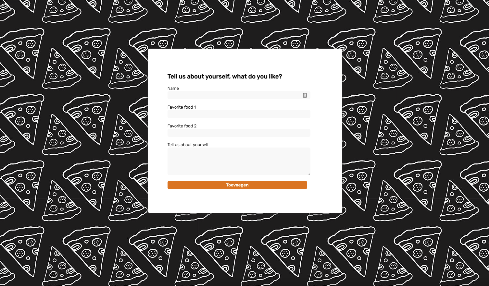
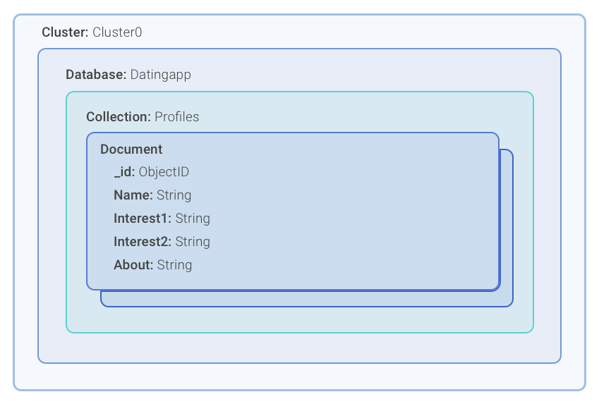

## Datingapp 
Met mijn datingapp kan de gebruiker door zijn/haar liefde voor voedsel de ideale partner vinden.
Ik heb een deel van deze datingapp uitgewerkt, namelijk het deel waarin de gebruiker zijn/haar informatie kan invullen. 
Ze kunnen hun naam invoeren, twee van hun favoriete gerechten (want op basis daar van gaan ze hun ideale partner vinden) en een korte beschrijving. 

Dit is hoe mijn feature er op dit moment uit ziet



### Installatie
Wil je deze feature ook lokaal op jouw pc hebben, volg dan de volgende stappen.
Zorg er voor dat je voorafgaand al NodeJS en NPM hebt geïnstalleerd.

### Clonen en installeren van mijn repo
1. Clone of download mijn repository

`gh repo clone hihijenny/backend-herkansingV02`


2. CD naar de map in jouw CLI

`cd /backend-herkansingV02`


3. Installeer de benodigde packages

`npm install`

### Opzetten van de database
4. Om de feature werkend te kijgen moet je ook een MongoDB database aanmaken,
mijn cluster ziet er zo uit: 



5. Plaats de .env file in de map en zet hier de juiste variabele in 

```
DB_NAME= Naam van jouw database
DB_PASS= Wachtwoord 
DB_USER= Gebruikersnaam
```

6. Je bent er nu klaar voor om de feature op jouw server te draaien!

`npm start`


## License 
[MIT License](https://www.google.com)

#### Auteur
Jenny Nijhof